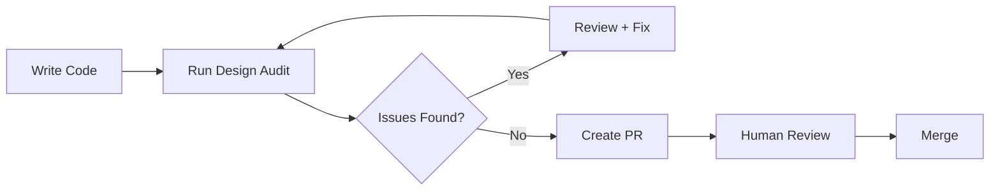

# OneSync Agent Skills Configuration

This project uses **Vercel Agent Skills** to enforce design, accessibility, and UX quality across the entire frontend codebase.

## Purpose

The agent skills system serves as an automated design reviewer that:
- Reviews frontend components for best practices
- Audits pages for UX and accessibility compliance
- Catches design regressions early in development
- Improves consistency across the application
- Provides actionable feedback before merge or deploy

## Installed Skills

### web-design-guidelines
A comprehensive skill that enforces modern web design best practices including:
- Accessibility standards (WCAG)
- Responsive design patterns
- Semantic HTML structure
- Visual hierarchy and typography
- Performance optimization
- Mobile-first design principles

**Installation:**
```bash
npx skills add https://github.com/vercel-labs/agent-skills --skill web-design-guidelines
```

## When to Use

### Before Merging Frontend PRs
Run a design audit to catch:
- Accessibility violations
- Responsive layout issues
- Semantic HTML problems
- Visual inconsistencies

### Before Production Deployment
Ensure production-ready quality:
- Performance verification
- Mobile usability check
- Cross-browser compatibility review
- SEO optimization validation

### When Adding New Pages or Layouts
Maintain consistency:
- Design system adherence
- Component reusability
- Spacing and typography alignment
- Color palette compliance

### During Code Reviews
Supplement human review:
- Automated accessibility checks
- Best practice validation
- Pattern consistency verification

## Scope of Audits

The following directories are in scope for design audits:

```
src/
├─ app/              # Next.js app router pages
├─ components/       # Reusable UI components
└─ lib/             # Utility functions (if UI-related)
```

## Out of Scope

Agent skills **do not**:
- Change business logic
- Modify API integrations
- Alter database queries
- Rewrite large sections of code
- Introduce new dependencies without approval

## Configuration

### Audit Priorities

1. **Critical**: Accessibility violations, broken responsive layouts
2. **High**: Semantic HTML issues, significant UX problems
3. **Medium**: Visual hierarchy improvements, spacing inconsistencies
4. **Low**: Optional enhancements, nice-to-have optimizations

### Report Format

All audit reports should include:
- 📁 **File path**: Exact location of the issue
- 🎯 **Component/Line**: Specific element or code section
- ❌ **Problem**: Clear description of what's wrong
- 💡 **Why it matters**: Impact on users or business
- ✅ **Suggested fix**: Actionable recommendation

## Tech Stack Context

OneSync uses:
- **Framework**: Next.js 15 (App Router)
- **Styling**: Tailwind CSS 3.4
- **UI Components**: Radix UI primitives
- **TypeScript**: For type safety
- **React**: 19.x

Skills should understand and work within this stack.

## Custom Rules for OneSync

### Design System
- Follow Tailwind CSS utility patterns
- Use custom theme tokens from `tailwind.config.ts`
- Maintain consistent spacing scale
- Adhere to defined color palette

### Component Standards
- All interactive elements must have focus states
- Buttons must have hover/active states
- Loading states for async operations
- Error states with clear messaging

### Accessibility Requirements
- All images must have alt text
- Forms must have proper labels
- Interactive elements must be keyboard accessible
- Color contrast must meet WCAG AA minimum

### Performance Targets
- First Contentful Paint < 1.8s
- Largest Contentful Paint < 2.5s
- Cumulative Layout Shift < 0.1
- First Input Delay < 100ms

## Integration Workflow



## Future Enhancements

- [ ] Create OneSync-specific custom skill
- [ ] Integrate with GitHub Actions
- [ ] Automated PR comment generation
- [ ] Design regression testing
- [ ] Component library validation
- [ ] Three.js performance audits (for 3D elements)

## Maintenance

### Updating Skills
```bash
npx skills update web-design-guidelines
```

### Adding New Skills
```bash
npx skills add <skill-url> --skill <skill-name>
```

### Listing Installed Skills
```bash
npx skills list
```

---

**Note:** This configuration is designed to scale with OneSync. As the project grows, we can add more specialized skills for Next.js, Three.js, or domain-specific patterns.
